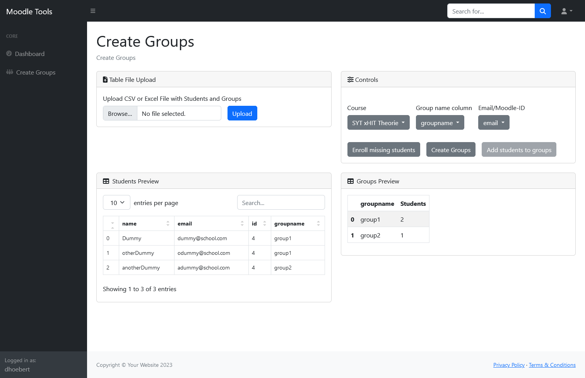

# moodle-tools

Collection of tools using the [Moodle API](https://sandbox.moodledemo.net/login/index.php) in
a [Flask](https://flask.palletsprojects.com/en/2.3.x/) Web App.

## Login

For some Apps User must be logged in using their moodle credentials (Moodle server and API service name can be changed
for each user).
Password will not be saved on the app. Instead the app tries to log the user into the moodle server.

## Create Groups

First App helps creating multiple groups and adding students automatically.
First a CSV or Excel file has to be uploaded (file will not be saved on the apps filesystem).
Target course can be chosen, table columns for groupnames and students email/moodle-id can be selected.
Then missing students can be automatically enrolled into the course. Groups can be created and students added to them.

## Errors

If a error occours during runtime, usually a logout [http://localhost:5000/logout](http://localhost:5000/logout) and
login helps.

## Usage

### [Docker](https://hub.docker.com/repository/docker/dominik1220/moodle-tools)

`docker pull dominik1220/moodle-tools`

`docker run --name moodle-tools -p 5000:5000 -e DEBUG=true -e host=0.0.0.0 -e DEFAULT_MOODLE_URL=https://moodle.school.com -e DEFAULT_MOODLE_SERVICE=service_name dominik1220/moodle-tools`

[http://localhost:5000](http://localhost:5000)

## Moodle API

Contact your moodle administrator for a moodle service including following web services:

- Login using Token (activate token /login/token.php generation for this service)
- core_group_create_groups
- core_group_add_group_members
- core_course_get_recent_courses
- core_enrol_get_enrolled_users
- enrol_manual_enrol_users
- core_user_get_users_by_field

## TODO

- ~~EXPOSE 5000~~
- ~~Remove password from session~~
- ~~Environment variables for standart values: moodle_url, moodle_service~~
- ~~add screenshots to readme~~
- preview table
    - color selected columns
    - color missing students
- ~~add session timeout~~
- add tool notify
- add tool upload
- add tool aggregate
- add automation
- Cookie “session” does not have a proper “SameSite” attribute value. Soon, cookies without the “SameSite” attribute or
  with an invalid value will be treated as “Lax”. This means that the cookie will no longer be sent in third-party
  contexts. If your application depends on this cookie being available in such contexts, please add the “SameSite=None“
  attribute to it. To know more about the “SameSite“ attribute,
  read https://developer.mozilla.org/docs/Web/HTTP/Headers/Set-Cookie/SameSite